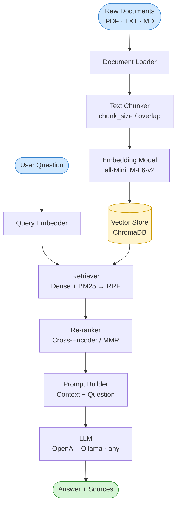
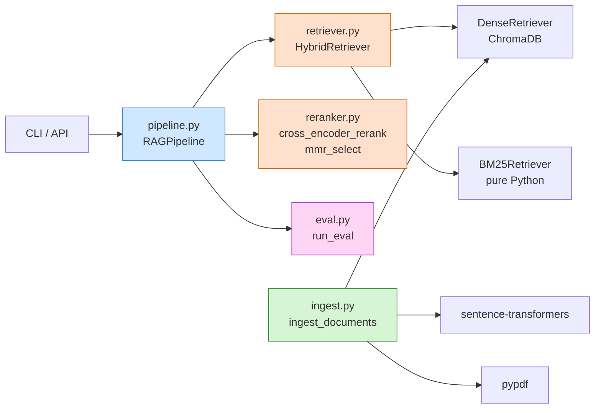

# Architecture

Four Mermaid diagrams covering the full system design of the Enterprise RAG pipeline.

---

## 1. Full RAG Pipeline

End-to-end flow from raw documents to generated answers.



---

## 2. Hybrid Retrieval with Reciprocal Rank Fusion

Two independent retrieval paths merged via RRF for best-of-both precision.

```mermaid
flowchart LR
    Q([Query]) --> QE[Query Embedder]
    Q --> QT[Query Tokeniser]

    subgraph Dense Path
        QE --> DC[ChromaDB\nVector Search]
        DC --> DR[Dense Results\n&#40;ranked list&#41;]
    end

    subgraph Sparse Path
        QT --> BM[BM25 In-Memory\nscorer]
        BM --> BR[BM25 Results\n&#40;ranked list&#41;]
    end

    DR --> RRF[Reciprocal Rank Fusion\nscore = α·rrf_dense + &#40;1−α&#41;·rrf_bm25]
    BR --> RRF
    RRF --> M[Merged & Re-ranked\nTop-K Candidates]

    style Q fill:#d0e8ff,stroke:#3380cc
    style M fill:#d5f5d5,stroke:#2d8c2d
    style RRF fill:#ffe0cc,stroke:#cc6600
```



---

## 3. Evaluation Framework

Offline evaluation loop computing retrieval and answer-quality metrics.

```mermaid
flowchart TD
    DS[(Eval Dataset\nquestion · relevant_ids\n· reference_answer)] --> EL[Eval Loop]

    EL --> PP[RAGPipeline.query]
    PP --> RET[Retrieved IDs]
    PP --> ANS[Generated Answer]

    RET --> R[Recall@K]
    RET --> MRR[MRR]
    RET --> ND[NDCG@K]

    ANS --> RL[ROUGE-L]
    ANS --> FA[Faithfulness\nToken Overlap]

    R & MRR & ND & RL & FA --> AGG[Aggregate Metrics\nMean over dataset]
    AGG --> REP([Metrics Report])

    style DS fill:#fff4cc,stroke:#cc9900
    style REP fill:#d5f5d5,stroke:#2d8c2d
    style AGG fill:#ffe0cc,stroke:#cc6600
```

---

## 4. Observability — Per-Query Latency Breakdown

Timing instrumentation across every stage of a single RAG query.

```mermaid
gantt
    title Per-Query Latency Breakdown (example — 180 ms total)
    dateFormat  x
    axisFormat  %L ms

    section Pipeline Stages
    Query Embed       :embed,    0,   15
    Dense Retrieve    :dense,    15,  45
    BM25 Retrieve     :bm25,     15,  23
    RRF Fusion        :rrf,      45,  48
    Cross-Enc Rerank  :rerank,   48, 160
    Prompt Build      :prompt,  160, 162
    LLM Generate      :llm,     162, 180
```



> **Latency targets (p50):**
>
> | Stage            | Target    |
> |------------------|-----------|
> | Query embed      | ≤ 15 ms   |
> | Dense retrieval  | ≤ 30 ms   |
> | BM25 retrieval   | ≤ 8 ms    |
> | RRF fusion       | ≤ 3 ms    |
> | Cross-enc rerank | ≤ 120 ms  |
> | LLM generate     | ≤ 500 ms  |
> | **Total (hybrid + CE)** | **≤ 680 ms** |

---

## Component Dependency Map


